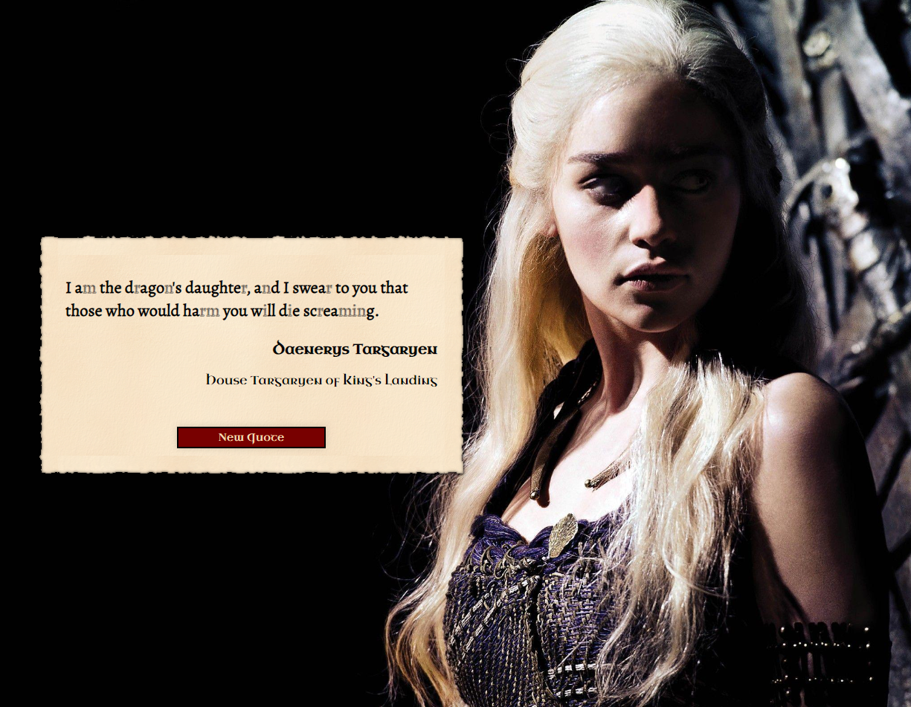
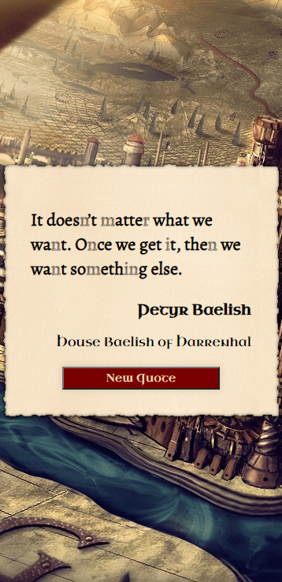

# Game of Thrones Quote Generator

A simple project that uses create-react-app, axios, and a free API to generate random quotes from the Game of Thrones. Styles are written with SCSS.

    
    

## Installation

Clone or download the repository 

### `git clone https://github.com/yourusername/game-of-thrones-quote-generator.git`

## Install the dependencies

### `npm install`

## Usage

1) Start the development server

### `npm start`

2) Open [http://localhost:3000](http://localhost:3000) to view it in the browser.
3) Click on "Generate Quote" button to get a new random quote from the Game of Thrones.

## API Used
[LINK](https://gameofthronesquotes.xyz/)

## Note

This project is for demonstration and educational purpose only.